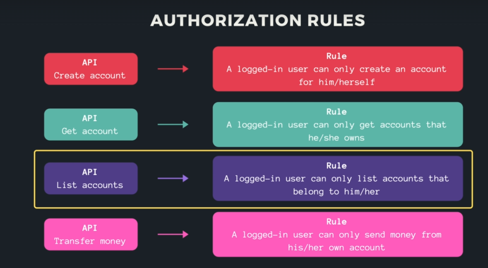

## Go-Mock
GoMock is now maintained by Uber: https://github.com/uber-go/mock. To generate the mock, I executed:
1) go install go.uber.org/mock/mockgen@latest
2) go get go.uber.org/mock/mockgen/model
3) mockgen -package mockdb -destination db/mock/store.go github.com/techschool/simplebank/db/sqlc Store

## Validation/v10
Using struct tag to provide meta data to struct fields.
To define a custom validation rule for currency, you can use the validator package that gin uses under the hood. Here’s how you can define and register a custom validation rule for currency:

- Define the custom validation function:
```go
package api

import (
    "github.com/go-playground/validator/v10"
)

var validCurrencies = map[string]bool{
    "USD": true,
    "EUR": true,
    "CAD": true,
}

func validCurrency(fl validator.FieldLevel) bool {
    currency := fl.Field().String()
    return validCurrencies[currency]
}
```

- Register the custom validation function:
```go
package api

import (
    "github.com/gin-gonic/gin"
    "github.com/go-playground/validator/v10"
)

func NewServer(store db.Store) *Server {
    router := gin.Default()

    if v, ok := binding.Validator.Engine().(*validator.Validate); ok {
        v.RegisterValidation("currency", validCurrency)
    }

    server := &Server{
        store:  store,
        router: router,
    }

    server.setupRouter()
    return server
}
```

- Update the createAccountRequest struct to use the custom validation:
```go
type createAccountRequest struct {
    Owner    string `json:"owner" binding:"required"`
    Currency string `json:"currency" binding:"required,currency"`
}
```

## Go-Mock Matcher Stuff
Test double matcher in go is confusing

## Golang Interface Casting
How does Interface work and why can you cast it.

## Rule Authorization


## Notes:
`ctx.MustGet`